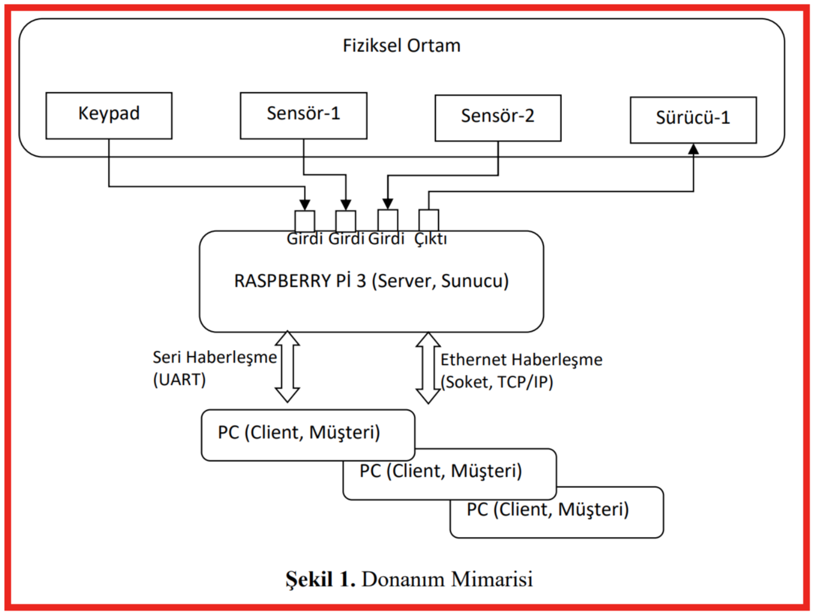
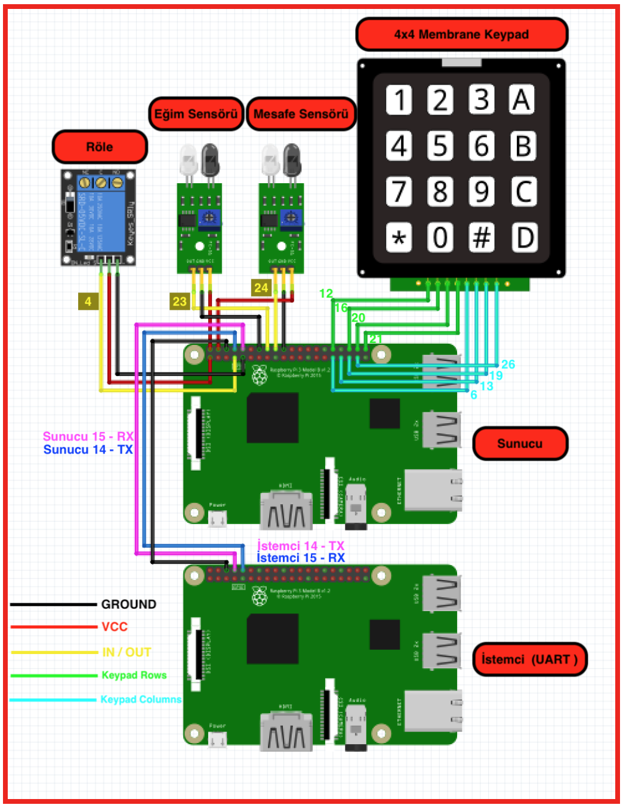

## Projenin Amacı
Raspberry Pi 3’ü, ev otomasyonunda kullanılacak bir alt sistem haline getirmektir. Ev otomasyonunda ihtiyaç duyulan algılayıcı( sensörler) ve sürücüler ( röle ) doğrudan Raspberry Pi 3’e bağlanacaktır. Bu sistem bir sunucu modül gibi çalışarak, üst seviyede yazılan uygulamalara ağ üzerinden ve seri bağlantı üzerinden algılayıcı ve sürücülere erişim imkanı sağlayacaktır.

## Donanım Mimarisi
   

## Donanım Tasarımı ve Gerçeklemesi
   
